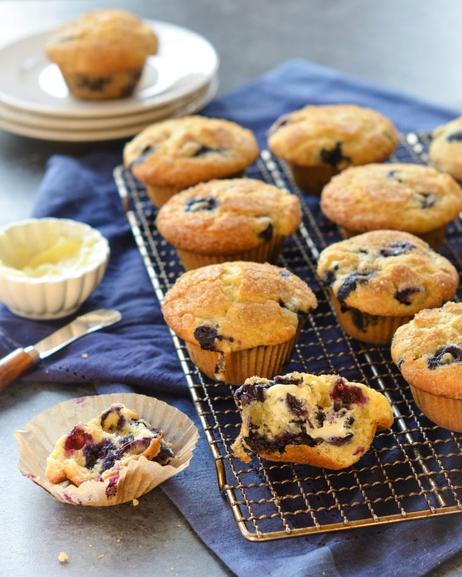
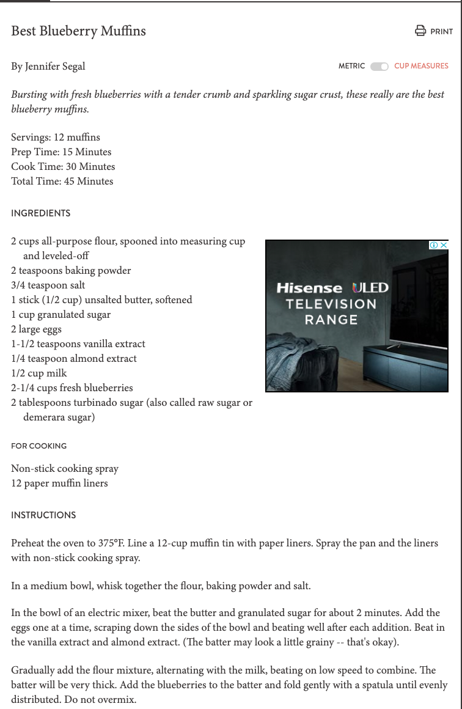

  
---
title: "BCO6007: Week 8 Tutorial"
author: "Maria Prokofieva"
date: "15/01/2020"
output: html_document
---

```{r setup, include=FALSE}
knitr::opts_chunk$set(echo = TRUE)
library(tidyverse)
library(tidymodels)
```

# Week 7: Modeling - data pre-processing

## Objectives

1. get to know basic steps in model building with a focus on **data preprocessing**
2. set up model flow using `tidymodels` with a focus on stage 1-data pre-processing
4. prepare data for further analysis using `tidymodels` with reference to different data types

----------------

*The examples are based on using `tidyverse` and `tidymodels` libraries, so you need to install it first if you have not! Uncomment the next `r` chunk and run it in your console*

----------------

We continue using `tidyverse` and `tidymodels` package, so please make sure that you `library(tidyverse)` and `library(tidymodels)`

We are also going to look at a few other packages to help us do `fancy things` in our data analysis

If you are totally new and never use `tidyverse` please make sure you  `install.packages("tidyverse")`. Please do the same for `tidymodels` as well.

The dataset comes from [Alice Zhao’s git repo](https://github.com/adashofdata) 

**Question**: what is the difference between cupcakes and muffins?

**Task**: classify recipes as either cupcakes or muffins based on the quantities used for each of the ingredients. 

{width=25%}

*References*:

The "inspiration" for this tutorial comes from [Rebecca Barter](http://www.rebeccabarter.com/blog/2019-06-06_pre_processing/) 

### Tidymodels and data preprocessing


`tidymodels` package, `recipes`, is designed to help you preprocess your data before training your model. **Recipes** are built as a series of preprocessing steps, such as:

- removing missing values

- converting number predictors to categories or **dummy** variables

- transforming data to be on a different scale = **scaling** and **normalizing** your data

- transforming whole groups of predictors together,

etc.

### The fundamentals of pre-processing your data using `recipes` package

Creating a recipe has four steps:

1. Get the ingredients (recipe()): specify the response variable and predictor variables

2. Write the recipe (step_zzz()): define the pre-processing steps, such as imputation, creating dummy variables, scaling, and more

3. Prepare the recipe (prep()): provide a dataset to base each step on (e.g. if one of the steps is to remove variables that only have one unique value, then you need to give it a dataset so it can decide which variables satisfy this criteria to ensure that it is doing the same thing to every dataset you apply it to)

4. Bake the recipe (bake()): apply the pre-processing steps to your datasets

```{r}
# load libraries
library(tidyverse)
library(tidymodels) # could also load the tidymodels package
# load in the data
muffin_cupcake_data_orig <- read_csv("https://raw.githubusercontent.com/adashofdata/muffin-cupcake/master/recipes_muffins_cupcakes.csv")
# look at data
muffin_cupcake_data_orig
```

Let's look at the variables: (actually, look at your dataset now!)

Variable names start with capital letter, also "Baking Powder" is spelt as two words and will be difficult to work with.

**Task**: convert all of the column names to lower case and replace the space with an underscore.

This is **pre preprocessing** - you do NOT change you data (=datapoints) at all!

```{r}
#make a copy of your dataset **just in case**
muffin_cupcake_data<-muffin_cupcake_data_orig

# change to lower case using `name` function
names(muffin_cupcake_data)<- tolower(names(muffin_cupcake_data))

#replace blanks with _
names(muffin_cupcake_data)<-str_replace(names(muffin_cupcake_data)," ", "_")

muffin_cupcake_data
```

**Task**: read help for `names` function. What does it do?

Let's also add one variable with `missing data`

```{r}
muffin_cupcake_data <- muffin_cupcake_data %>%
  mutate(additional_ingredients = c("fruit", 
                                    "fruit", 
                                    "none", 
                                    "nuts", 
                                    "fruit", 
                                    "fruit", 
                                    "nuts", 
                                    "none", 
                                    "none", 
                                    "nuts",
                                    "icing",
                                    "icing",
                                    "fruit",
                                    "none",
                                    "fruit",
                                    "icing",
                                    "none",
                                    "fruit",
                                    "icing",
                                    "icing"))

muffin_cupcake_data

```

Working with machine learning, we start with splitting data into training and test sets using `initial_split`, `training` and ` testing` functions.

```{r}
muffin_cupcake_split <- initial_split(muffin_cupcake_data)
muffin_cupcake_train <- training(muffin_cupcake_split)
muffin_cupcake_test <- testing(muffin_cupcake_split)

muffin_cupcake_train

muffin_cupcake_test
```

### Writing and applying the recipe

working with data pre-processing is the same as "puting ingredients together" - that is why they named the package `recipe`.

{width=25%}

1. The first thing we need to do is get the ingredients using `recipe()` function: 

the thing we’re trying to predict (=**output**) is the variable to the left of the `~`,
and the **predictor** variables are the things to the right of it.

You can either include all variabeles, like this

```{r}
model_recipe <- recipe(type ~ flour + milk + sugar + butter + egg + 
                         baking_powder + vanilla + salt + additional_ingredients, 
                       data = muffin_cupcake_train)
```
OR

use `.` to refer to *the rest of variables in your data*

```{r}
model_recipe <- recipe(type ~ ., 
                       data = muffin_cupcake_train)
```

If we print a summary of the `model_recipe` object, it just shows us the variables we’ve specified, their type, and whether they’re a predictor or an outcome.
```{r}
summary(model_recipe)
```

### Writing the recipe steps

So now we have our ingredients, we are ready to write the recipe (i.e. describe our pre-processing steps). We write the recipe one step at a time. We have many steps to choose from, including:

`step_dummy()`: creating dummy variables from categorical variables.

`step_meanimpute()`: impute= replace missing values - in this case with average values

`step_scale()` and `step_center()`: normalize and center your variables.

`step_nzv()`: remove variables that have (or almost have) the same value for every data point.

`step_range()`: normalize numeric data to be within a pre-defined range of values.

To specify the variables in a function you can use:

`all_predictors()`: to apply the step to the predictor variables only

`all_outcomes()`: to apply the step to the outcome variable(s) only

`all_nominal()`: to apply  the step to all variables that are nominal (categorical)

`all_numeric()` applies the step to all variables that are numeric

```{r}
# define the steps we want to apply
model_recipe_steps <- model_recipe %>% 
  # mean impute numeric variables
  step_meanimpute(all_numeric()) %>%
  # convert the additional ingredients variable to dummy variables
  step_dummy(additional_ingredients) %>%
  # rescale all numeric variables except for vanilla, salt and baking powder to lie between 0 and 1
  step_range(all_numeric(), min = 0, max = 1, -vanilla, -salt, -baking_powder) %>%
  # remove predictor variables that are almost the same for every entry
  step_nzv(all_predictors()) 

model_recipe_steps

```

**Task** Look at the script and discuss the steps!

### Preparing the recipe
Next, we need to provide a dataset on which to base the pre-processing steps. This allows the same recipe to be applied to multiple datasets.

```{r}
prepped_recipe <- prep(model_recipe_steps, training = muffin_cupcake_train)
prepped_recipe
```

### Bake the recipe
Next, you apply your recipe to your datasets.

So what did our recipe do?

`step_meanimpute(all_numeric())` imputed all of the missing values with the mean value for that variable

`step_dummy(additional_ingredients)` converted the additional_ingredients into three dummy variables corresponding to three of the four levels of the original variable

`step_range(all_numeric(), min = 0, max = 1, -vanilla, -salt, -baking_powder)` converted the range of all of the numeric variables except for those specified to lie between 0 and 1

`step_nzv(all_predictors())` removed the salt variable since it was 0 across all rows (except where it was missing)

```{r}
muffin_cupcake_train_preprocessed <- bake(prepped_recipe, muffin_cupcake_train) 

muffin_cupcake_train_preprocessed
```

```{r}
muffin_cupcake_test_preprocessed <- bake(prepped_recipe, muffin_cupcake_test)
muffin_cupcake_test_preprocessed
```
