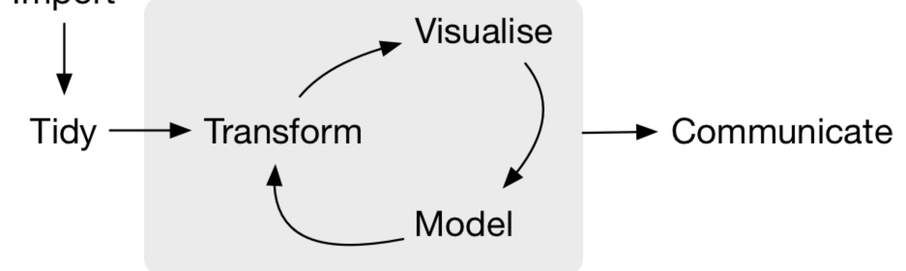

```{r setup, include=FALSE}
options(htmltools.dir.version = FALSE)
knitr::opts_chunk$set(echo = TRUE,   
                      message = FALSE,
                      warning = FALSE,
                      fig.height = 4,
                      fig.width = 8,
                      fig.align = "center")
library(tidyverse)
```
#Key points

- Data wrangling

- Tidy format

- Terminology of data

- How to make you data tidy

- `tidyverse` package

### It is not a programming unit! We concentrate on **DATA**!!!

*Use the same project `BCO6007` you created in week 1.
---
#Data wrangling

or **data munging**

is the process of transforming and mapping data from one *"raw"* data form into another format to make it more appropriate and valuable for further processing.


---
#Data preparation 

Library `tidyverse` [https://www.tidyverse.org/](https://www.tidyverse.org/)


---
#Updated workflow


---
#Install `tidyverse`

```{r eval=FALSE}
#Step 1
install.packages("tidyverse") #run only ONCE to install!

#Step 2
library(tidyverse) #run in every file that uses tidyverse functions
```

`tidyverse` is a collection of packages combined to help with data wrangling
More help is at https://www.tidyverse.org/ 
---
#Data import
## Sources of data:

- Flat files (e.g.csv and xls)
read_csv() 
write_csv()

- "old"
read.csv()
write.csv()

- readxl()

```{r}
avocado<-read_csv("avocado.csv")
head(avocado)
```
---
#Data import: dates/times

`ymd()`
`ymd_hms()`
`dmy()`
`dmy_hms()`
`mdy()`

```{r}
#install.packages("lubridate")
library(lubridate)

#Example 1
ymd(20200830)

date<-"20190130"
date %>% ymd()

#Example 2
mdy("1/24/18")

```
---
#Data basics

Data from a study on US grad programs.

Originally came in an excel file containing rankings of many different programs.

Contains information on four programs:

-Astronomy
- Economics
- Entomology, and
- Psychology
`%>%` **Piping**

```{r}
library(tidyverse)
grad<-read_csv("graduate-programs.csv")
grad %>% top_n(10)
```
---
#Piping

Piping is a special symbol `%>%` that allows you to "shuffle" your data from one step of processing to another set.

Compare the use of `head()` and `top_n()` function with the same dataset
.pull-left[
```{r}
avocado %>% top_n(15)
```
]

.pull-right[
```{r}
head(avocado)
```
]
---
#Data basics

**Variable**: A quantity, quality, or property that you can measure.

**Observation**: A set of measurements made under similar conditions

Contains several values, each associated with a different variable.

Let’s have a look at our example: graduate-programs.csv in RStudio Cloud.

Now, it’s your turn:

"What is the average number of graduate students per
economics program?:"

"What is the best description of the relationship between
number of students and median time to degree?"

---
- "The average number of graduate students per economics program is:"
- "about 61" (correct)
- about 39
"What is the best description of the relationship between number of students and median time to degree?"
- "as the number of students increases the median time to degree increases, weakly" (correct)
- as the number of students increases the variability in median time to degree decreases
---

---
#Data vs tidy data 

“Real data is **messy**. ...It's all **very noisy** out there. Very hard to spot the tune. Like a piano in the next room, it's playing your song, but unfortunately it's out of whack, some of the strings are missing, and the pianist is tone deaf and drunk- I mean, the noise! Impossible! ”
― *Tom Stoppard*

“The first change we had to make was just to make our data of higher quality. We have **a lot of data**, and sometimes we just weren’t using that data, and we weren’t paying as much attention to its **quality** as we now need to…"
*Ash Gupta*

“I think you can have a ridiculously **enormous** and **complex** data set, but if you have the **right tools** and **methodology**, then it’s not a problem.” 
*Aaron Koblin*
---
#Tidy data vs messy data
.pull-left[
```{r}
table1

table2
```
]

.pull-right[
```{r}
table3

table4a
```
]
---
#Rules of tidy data:

- Each variable must have its own column.
- Each observation must have its own row.
- Each value must have its own cell.

What if my data is not tidy?

*Use `tidyverse` to tidy it up!*


---
#Basic functions to review

-`top_n()`

- `count()`

- `add_count()`

- `summarize`

- `filter()`

- `select()`

- `pivot_wide` vs `pivot_long`

- `fct_reorder()`

- `fct_lump()`

- `separate()`

= `extract()`

---

#Take away points

- loading `tidyverse`

- tidy data rules

- working with functions through piping `%>%`


