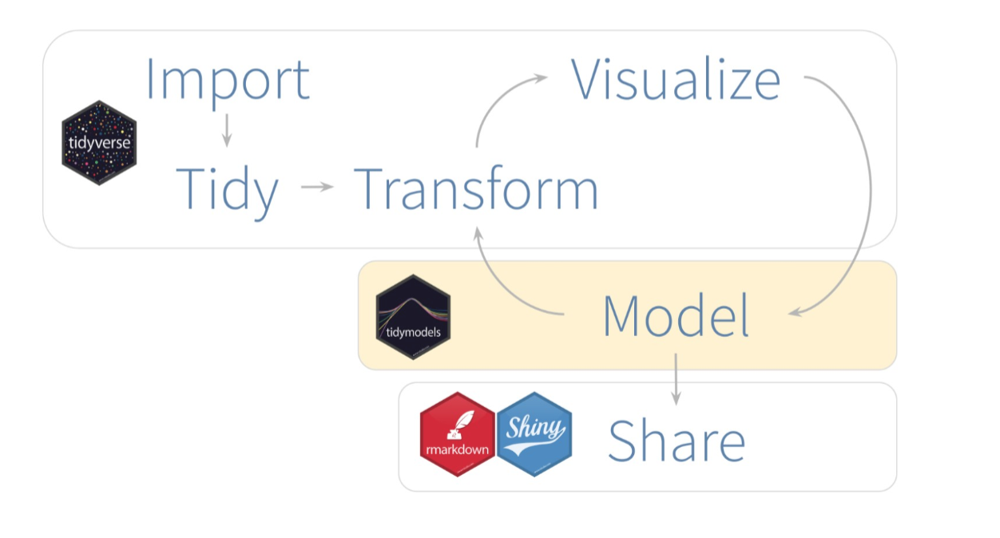
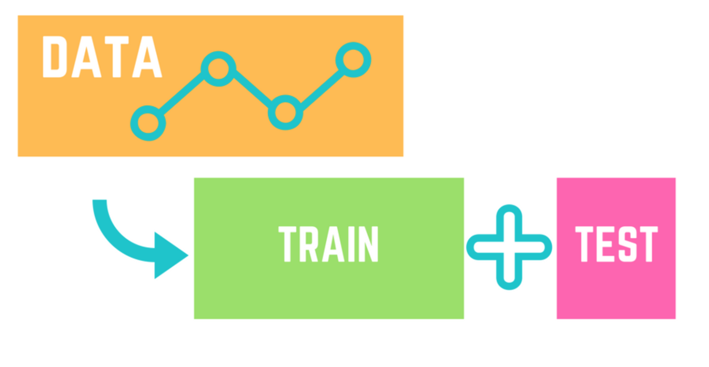
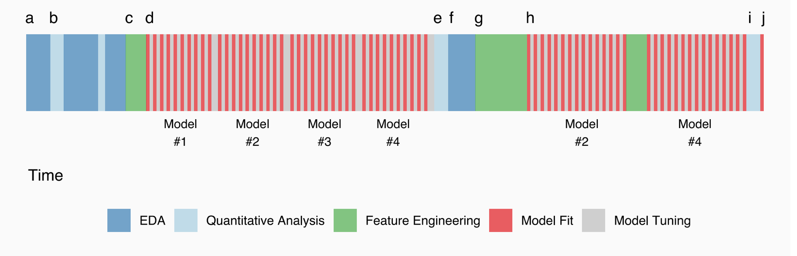
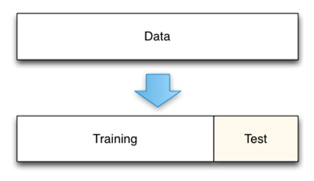
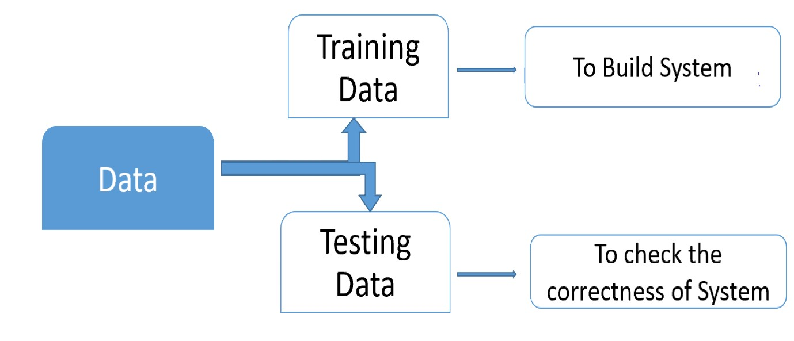
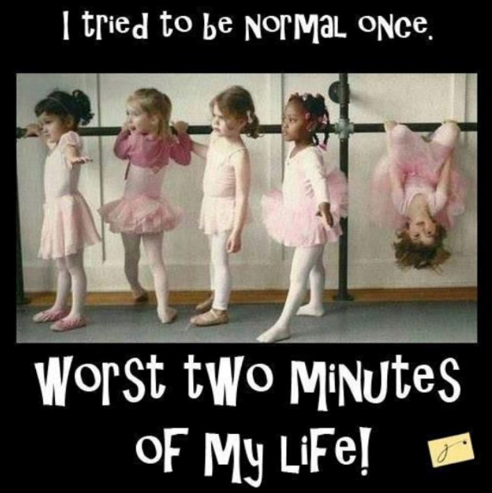
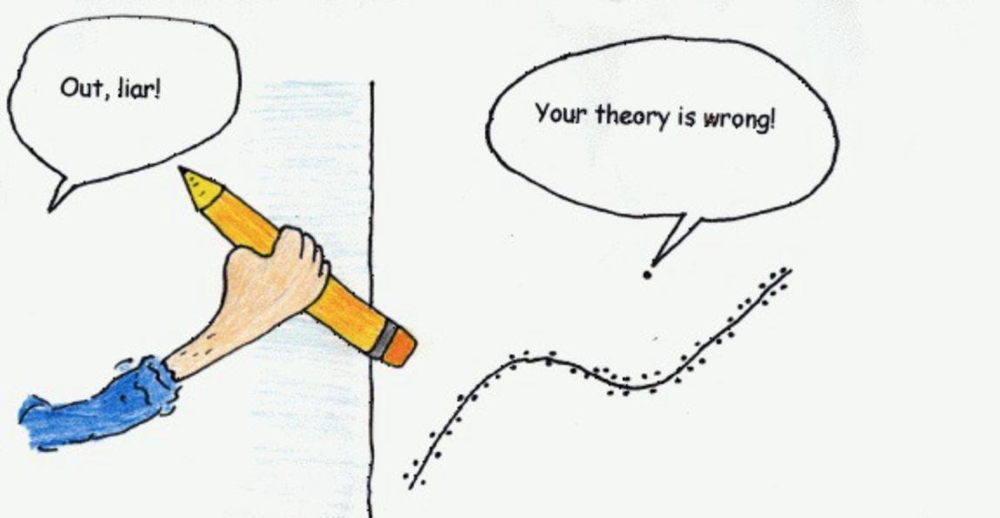

```{r setup, include=FALSE}
options(htmltools.dir.version = FALSE)
knitr::opts_chunk$set(echo = TRUE,   
                      message = FALSE,
                      warning = FALSE,
                      fig.height = 4,
                      fig.width = 8,
                      fig.align = "center")
library(tidyverse)
library(lubridate)
library(maps)
```
#Key points

- model and its variables
- modelling workflow
- types of modelling
- data preparation
- `tidyverse` package
- `tidymodels` package

.pull-left[
##Basic functions to review

`na.rm`
`skim`
`initial_split`
`training`
`testing`
`glimpse`
`recipe`
`prep`
`step_corr`
`step_center`
`step_scale`
`all_predictors`
- 
]
.pull-right[
If you want to get quick info on any function you type in the console
`?NameOfFunction`
e.g 
```{r}
?slice
```
]
---
#Workflow for the lecture

1. Open your `RStudio.cloud` `BCO6007` project

2. Create a new lecture R script document - e.g. lecture6.R

3. Practice all lecture examples there

4. load libraries `tidyverse` and install and load `tidymodels`

5. load datasets - 
```{r}
grad<-read_csv("graduate-programs.csv")
avocado<-read_csv("avocado.csv")
```
---
# Introduction to modeling 

Models are everywhere!


---
# Model and variables

**Model** is a representation of something which provides some information about it.

The aim is to **train a model** that can be used for **inference** (= "educated guess"), making **predictions** on new **data points**.

---
# Modelling and model


---
# What is the aim of modeling?

- Build your model with your training data
- Choose your model with your validation data, or resampled datasets
- Evaluate your model with your testing data


---

# What is a model

modeling as pasta making!


# How do you make your pasta by hand?

1. you have your dough

2. your split your dough and start experimenting!

3. your take your pasta machine and play with settings to set the "perfect" width/length/colour (?)

4. Once you are happy with the settings on your pasta machine you take your "main" dough and start making your pasta!

5. Once your settings are "set" you do not change them a lot - may be just fine tuning to adjust to your dough
---
# How do you make your pasta by hand?


---
# Now let's use proper terminology

1. you have your dough (= prepare your data)

2. your split your dough and start experimenting! (= split your data into *testing* and *training* set)

3. your take your pasta machine and play with settings to set the "perfect" width/length/colour (?) (= set your model using the "training" dough, oh... DATA!)

4. Once you are happy with the settings on your pasta machine you take your "main" dough and start making your pasta! (= use your model on the "testing" dough, oh.. DATA!)

5. Once your settings are "set" you do not change them a lot - may be just fine tuning to adjust to your dough (= model is ready for use!)
---


---
# The Modeling Process

Common steps during model building are: 

- preparing data
- estimating model parameters (i.e. training models) 
- setting "tuning" parameters 
- comparing different models on the same data
- calculating the performance of the final model that will generalize to new data 
modelling = a marathon not short sprint! 
---
# What the Modeling Process Usually Looks Like



---
# Input vs output vatiables

Input variables: "independent", predictors
- variables you put in your model
= your "dough"

Output variables: "dependent" variables
- response variables
- your "pasta" you make

Let's think about some examples!
---

---
# Why train? Why test?

= let's look in the past to see what our future will look like!

= but can we look into the future? Time machine?

= let's pretend that part of our "past" is the "future!
---

---
# Training vs testing data

Training data is for "training" the model
Testing data is for "evaluation" the model


---
#Question:

What if your new data is very different from what you used for modeling?

What if your data is "not enough"?
---


---
# So we go and "model" and now


---

# and NOW!


---
# Data preparation

Success of modelling depends on the "quality" of data

80% of time is spent on preparing data!

Common issues:

- missing data

- outliers and wrongly recorded data

- variables are too closely related (=correlated)

- "variance" (=variability) in data
---

# Missing data

= no data value is stored for the variable in an observation

Usually, recorded as **NA** instead of values

`is.na` function returns `TRUE` for `NA`

```{r}
  sum(is.na(grad$PctAsstProf))
```
---
# Missing data

Tasks: discuss why missing values is a serious issue for data analysis

A common treatment is to remove `NA` in functions: e.g. `na.rm=TRUE`
```{r}
mean(grad$PctAsstProf, na.rm=TRUE)
```
---
# Outliers and wrongly recorded data

Too "different" observations


---
# Why outliers are bad?



---
# What to do with outliers?

- remove from the data

- replace with "normal" data points
---
# How to detect outliers?

Examine your data

```{r eval=FALSE}
#install.packages("skimr")
library(skimr)

grad %>%
  select (AvNumPub, PctFacGrants,NumStud)
  skim()
```
---
#Means and sd

Mean= average

sd= standard deviation (sounds scary!)
= how much the members of a group differ from the mean value for the group

If `sd` is too high, you may have an outlier! 
---
# `Tidymodels` package

Works magic with modeling taking all the stats away.

```{r eval=FALSE}
install.packages("tidymodels")
```

The `tidymodels` framework is a collection of packages for modeling and machine learning using `tidyverse` principles.

Read it [here](https://www.tidymodels.org/)
---
# How to work with tidymodels


---
# What is for next week?

Step 2 - Train the model (to be discussed next week!)

Three concepts in specifying a model

- Model type
- Model mode
- Model engine
---
# Let's have some pasta!


