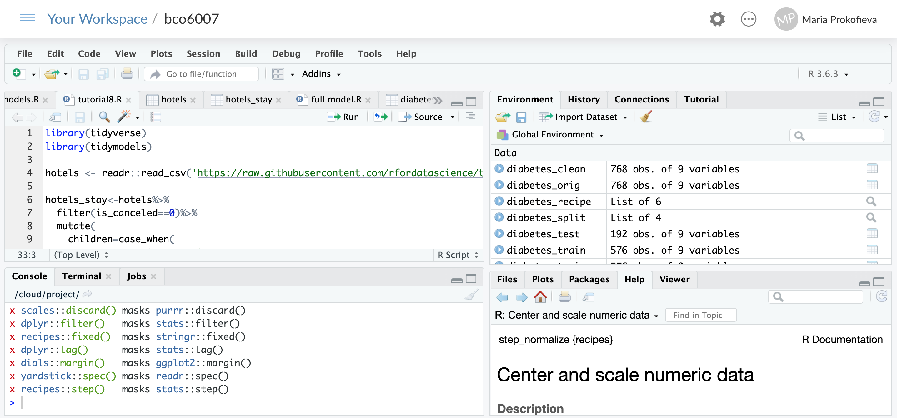

```{r, echo = FALSE, message = FALSE, warning = FALSE, warning = FALSE}
knitr::opts_chunk$set(
  message = FALSE,
  warning = FALSE,
  error = FALSE, 
  collapse = TRUE,
  comment = "#",
  fig.height = 4,
  fig.width = 8,
  fig.align = "center",
  cache = FALSE
)
library(emo)
```

## Week 1:

This week we are getting into basics: how to R

A screencast of the tutorial is available [here](https://www.youtube.com/channel/UCTpTqzAm8DCANz7ifhRI-sA?disable_polymer=true):

### Things to cover:

1. Setting up RStudio Cloud account [here]()
2. Workthrough your `RStudio.cloud` account
3. Work with 2 types of documents:
- `R script`
- `RMarkdown` document.
- `R` syntax and basic functions: BUT 

Remember: **This is not a programming unit! We focus on data and working with data**


### What is R?

https://www.computerworld.com/article/2497143/business-intelligence/business-intelligence-beginner-s-guide-to-r-introduction.html

R is a language and environment for statistical computing and graphics.

The R language is widely used for data science and stats to do data exploration, data analysis, data viz as well as developing statistical software.

R is free to use and the number of users are growing fast (well, it's free and bubbly community!) with lots of helpful packages at `CRAN` = `Comprehensive R Archive Network`.

[`CRAN`](https://cran.r-project.org/) is a network of ftp and web servers around the world that store identical, up-to-date, versions of code and documentation for R.

## RStudio and RStudio Cloud


## RStudio environment

`RStudio` comes as a desktop application (*IDE* = Integrated development environment) and `RStudio Cloud` (which we are using in this unit).

You do not need to install `RStudio Cloud`, you just create your account there when you go to https://rstudio.cloud/

Optional: you can install a desktop version of RStudio from [here](https://rstudio.com/products/rstudio/download/#download). Make sure that you install R first from [here](https://cran.rstudio.com/) and then RStudio. This will allow you to run a copy of RStudio on your local computer.



The RStudio interface has the following components including:
1. `Source editor` window` where you write and edit your files: 
  - Docking station for multiple files - each file is  tab
  - Useful shortcuts, such as `Run` for R code or `Knit` for RMarkdown documents  
  - Code-checking: give you "suggestions" as you write (e.g. hints about syntax of functions)
  - Debugging features  
  
2. `Console` window where you can run your code directly as well as it shows execution of your scripts 
  - Highlighting/Tab-completion, e.g. Red spot shows you when  your code is executed
  - "History"= Recent commands

3. Other tabs/windows: 
  - Files: to access your files and navigate folders
  - Plots: to show your graphics and data viz
  - Help: very useful as you will get all the R knowledge there and R documentation
  - Other tools, such as package development, git, etc
  
There's a [cheatsheet](https://rstudio.com/wp-content/uploads/2016/01/rstudio-IDE-cheatsheet.pdf) in the "Help" menu, on tips for using this interface.

#### Task:
- Set up your free RStudio Cloud account and create your workspace "BCO6007"

`Workspace` is your current R working environment. It includes all your objects, such as data and files. Once you finish your work, it saves a copy of the current workspace and reloads the next time R is started.

## Projects

Your workspace may have 1+ **projects**

`Project` are  folders where you keep your work organized: it has your data, your code, your results all located in one place. 

#### Task:

- Create a ptoject called `BCO6007` and locate your files under the `Files` tab. 
Make sure that you always work in the correct project for this class,
`r emo::ji("smile")`


## R Script and RMarkdown documents

we will work with two types of documents in this unit:
- R script: R code to do data analysis
- RMarkDown document: which is a document that combines R script and normal text. In the rmarkdown document you can present your data analysis (R code) and talk about data and results of analysis as well as show dataviz.

#### Task:

- Create an empty R script: 
* File -> New file -> R script 
- Save the file as `practice1.R`

- Upload a rmarkdown document to your project `week1.Rmd`
You need to download the file from VUCollaborate to your local computer and then upload it.
- Open the file in RStudio Cloud.

Notice the difference in extension `.R` vs `.Rmd`

You can read more about RMarkdown [here](https://rmarkdown.rstudio.com/lesson-1.html). 
We will also have a dedicated tutorial for it.

**To run an .R script you need to press `Run` or `Ctrl+Enter` (on Mac `Command+Return`) the line with your cursor.

To run your RMarkdown document you need to press `Knit` from the top panel.

Run `week1.Rmd` by pressing Knit and compare the page that is generated (Web page) with the code in your RStudio Cloud.

#### Tasks 
Work out how to run 
- a chunk of code in Rstudio
- one line of R code?
- Loate the line that starts with "```{r}."
What happens when you `Run` it

### Some R Basics
Switch to your `practice1.R` and 

* Type and run the following commands:

```
150/3
a<-5*10^2
b<-"Cool"
```

Notice what is `<-` 
It assigns value to variables that appear in `Environment`

* R has good help support for documentation. Find the help page for the `mean` command, either from the help menu, or by typing one of these: `help(mean)` and `?mean`. Most help pages have examples at the bottom.

* The `summary` command can be applied to almost anything to get a summary of the object. Try `summary(c(3,4, 6, 4))`

What do you think is `c(x, y, z)` - ti is a **vector* with data.

But this is to "booooring", let's move on to more exciting things~


## Working with packages (=libraries) 


## Exercise 4

- What's an R `package`?
- How do you install a package?
- How does the `library()` function relates to a `package`?
- How often do you load a `package`?
- Install and load the package `ISLR`

## Getting data

Data can be found in R packages

```{r}
library(tidyverse)
data(economics, package = "ggplot2")
# data frames are essentially a list of vectors
glimpse(economics)
```

These are not usually kept up to date but are good for practicing your analysis skills on.

Or in their own packages

```{r}
library(gapminder)
glimpse(gapminder)
```

I primarily use the `readr` package (part of the `tidyverse` suite) for reading data now. It mimics the base R reading functions but is implemented in `C` so reads large files quickly, and it also attempts to identify the types of variables.

```{r}
candy <- read_csv("https://raw.githubusercontent.com/fivethirtyeight/data/master/candy-power-ranking/candy-data.csv")
glimpse(candy)
```

You can pull data together yourself, or look at data compiled by someone else. 

## Question 1

- Look at the `economics` data in the `ggplot2` package. Can you think of two questions you could answer using these variables?

- Write these into your `.Rmd` file. 

## Question 2

- Read the documentation for `gapminder` data. Can you think of two questions you could answer using these variables?

- Write these into your `.Rmd` file. 

## Question 3

- Read the documentation for `pedestrian sensor` data. Can you think of two questions you could answer using these variables?

- Write these into your `.Rmd` file. 

## Question 4

1. Read in the OECD PISA data (file `student_sub.rds` is available at from the course web site)
2. Tabulate the countries (CNT)
3. Extract the values for Australia (AUS) and Shanghai (QCN)
4. Compute the average and standard deviation of the reading scores (PV1READ), for each country
5. Write a few sentences explaining what you learn about reading in these two countries.

## Homework

Using your *free* DataCamp account, work your way through the free tutorial [Introduction to R](https://www.datacamp.com/courses/free-introduction-to-r). This provides some good insights on the data types you will commonly use in R.

## Got a question?

It is always good to try to solve your problem yourself first. Most likely the error is a simple one, like a missing ")" or ",". For deeper questions about packages, analyses and functions, making your Rmd into a document, or simply the error that is being generated, you can often google for an answer. Often, you will be directed to 
[Q/A site: http://stackoverflow.com](http://stackoverflow.com).

Stackoverflow is a great place to get answers to tougher questions about R and also data analysis. You always need to check that someone hasn't asked it before, the answer might already be available for you. If not, make a [reproducible example of your problem, following the guidelines here](https://reprex.tidyverse.org/articles/reprex-dos-and-donts.html) and ask away. Remember these people that kindly answer questions on stackoverflow have day jobs too, and do this community support as a kindness to all of us.

