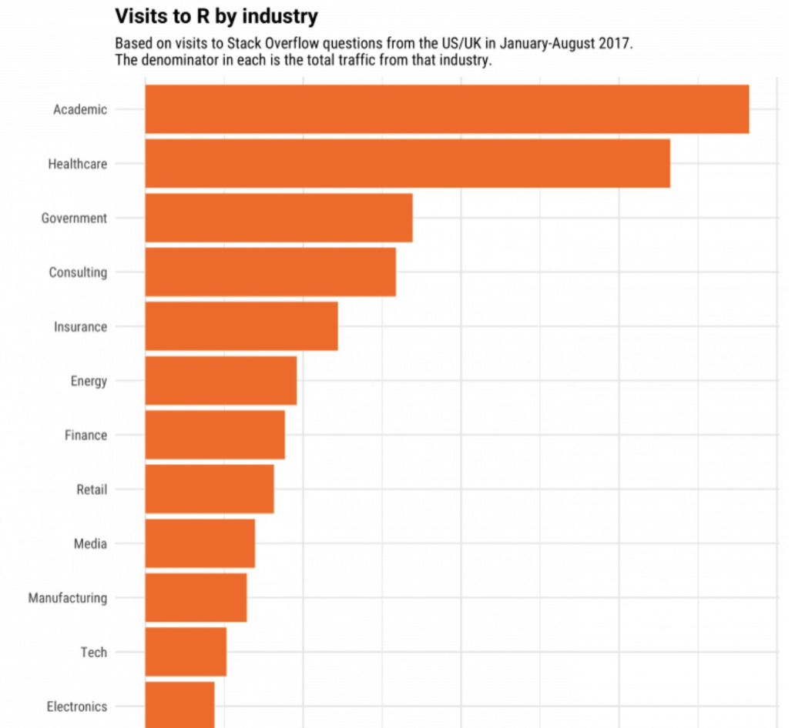
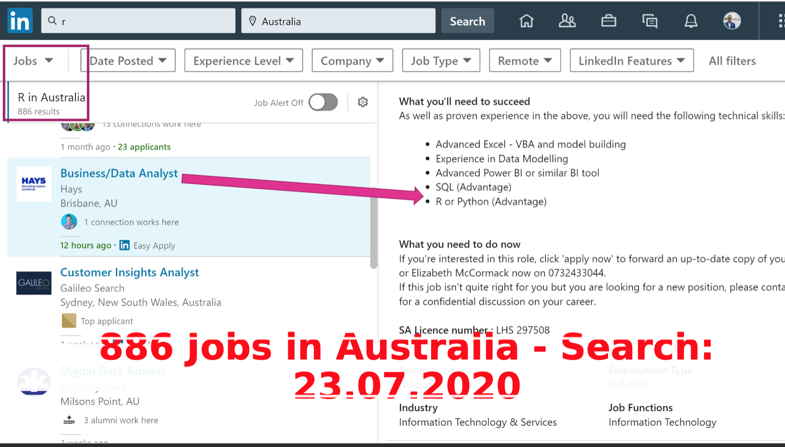
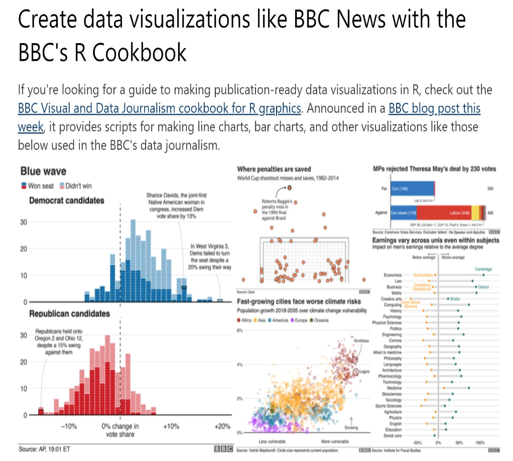

```{r setup, include=FALSE}
options(htmltools.dir.version = FALSE)
```
#Teaching staff

Unit coordinator: Dr Maria Prokofieva
email: maria.prokofieva@vu.edu.au
**Consultation times**: please see VU Collaborate

Please use **BCO6007** in the *Subject line* to get a timely response
---
# Unit outline

- Bring your laptop to lectures!
- We will be running example

## Unit topics:
- Introduction to Business Analytics:
- Basics of data viz (`ggplot2` package and `RMarkdown`)
- Data Sources and Extraction (`tidyverse` package)
- Advanced data wrangling (`tidyverse` package)
- Dealing with different datatypes (`tidyverse` package)
- Introduction to modeling (`tidymodels` package)
- Further modelling (`tidymodels` package)
- Most common statistical models (`tidymodels` package, `caret` package)
- Evaluation of models (`tidymodels` package, `caret` package)
- Practical cases: working with text (`tidyverse` package)
- Practical cases: interactive documents and dashboards (`RMarkdown` and `flexdashboard`, introduction to `RShiny`)
- Presentation

<!-- your comment -->
---
# Assessment

- **In class tests**: 3 throughout the semester (25%)

- **Practical exercises**: data wrangling and manipulation, individual. 
Very practical! (35%)

- **Research report**: a report based on data analysis + presentation, groups of 2. Practical + research (40%)

*Hints*:  

- Form your groups early, so you can start working on your project

- Make sure you set up your group at VU Collaborate -> Communication -> Groups

- Exchange your details, including non-VU emails and phone numbers.

- Great idea to use WhatsApp and Zoom!

- As well as set up common space to store your files: e.g. OneDrive / Dropbox
---
# Textbook

- Wickham, H., & Grolemund, G. (2017). **R for data science**: import, tidy, transform, visualize, and model data (First edition.). O’Reilly Media.
Available at [here](https://r4ds.had.co.nz/)

- Yihui Xie, J. J. Allaire, Garrett Grolemund (2020). **R Markdown**: The Definitive. Guide.
Available [here](https://bookdown.org/yihui/rmarkdown/)

- Wickham, H. (2009).  **ggplot2**: Elegant Graphics for Data Analysis
Available [here](https://ggplot2-book.org/)
---
# Expectations

- Turn up to class, summarise your notes after each, note what you understand, and what you don't

- Do exercises from the textbook related to material each week, check your answers with solution️s

- Participate actively in computer labs, work with team mates to solve problems, get best answers 

.footnote[[*] I update my class material every week, so need to check them in before the class!]
---

#Coding?

**This is NOT a programming unit! We focus on data**

Why R:

- Free software environment 

- Widely used among statisticians and data analysts

- Easy to learn and use for data manipulation, statistical modeling, and graphics

- Used by many large companies: uUber, Google, Airbnb, Facebook and so on
---
# Industry and R

{width=20%}

---
# Jobs in R

{width=20%}

---
# Data visualization in R

{height=20%}

```{r, echo=FALSE, out.width="50%", fig.cap="A nice image."}

```


---

# Business analytics - ?

https://www.youtube.com/watch?v=McfrHyg0tGI


http://blog.rtwilson.com/john-snows-cholera-data-in-more-formats/

---
# What is business analytics?

- **Business analytics** is the scientific process of learning from data, transforming data into insight for making better decisions

- *Broader* than **business intelligence** which focuses on describing and predicting performance.

- *Broader* than **econometrics/statistics** which typically starts from theory (hypotheses or models), and analysts assess if the data supports or refutes.

- *Narrower* than **data science** as we are primarily focusing on *business problems*
---
# Getting The Right Information

- Only 36% of CIO’s believe management is using the right Information to run the business (*Gartner Research 2020*)

- Less than one in **ten** corporate executives believe they have the **necessary** information when they need it to make **critical** business decisions. 

- More than **half** of these senior executives are concerned that as a result of *missing* information, they may be making poor decisions and a quarter believe that management frequently or always gets its decisions wrong. (*Economist Intelligence Unit 2020*)
---
# So what?

## The biggest question in business analytics is ‘Why?’ 

---
# So what?

- Why is this happening? If you notice that there’s a pattern, ask, **“Why?”** 

- Is there something wrong with the data or is this an actual pattern going on? 

- Can we conclude anything from this pattern? A natural curiosity will definitely give you a good foundation.-- *Carla Gentry, Data Scientist at Talent Analytics*


- **[Business analysts** are] able to think of ways touse data to solve problems that otherwise would have been unsolved, or solved using only intuition.*-- Peter Skomoroch, Former Principal Data Scientist at Link*

---
class: center, middle

# Thanks!

Slides created via the R package [**xaringan**](https://github.com/yihui/xaringan).

The chakra comes from [remark.js](https://remarkjs.com), [**knitr**](http://yihui.org/knitr), and [R Markdown](https://rmarkdown.rstudio.com).
